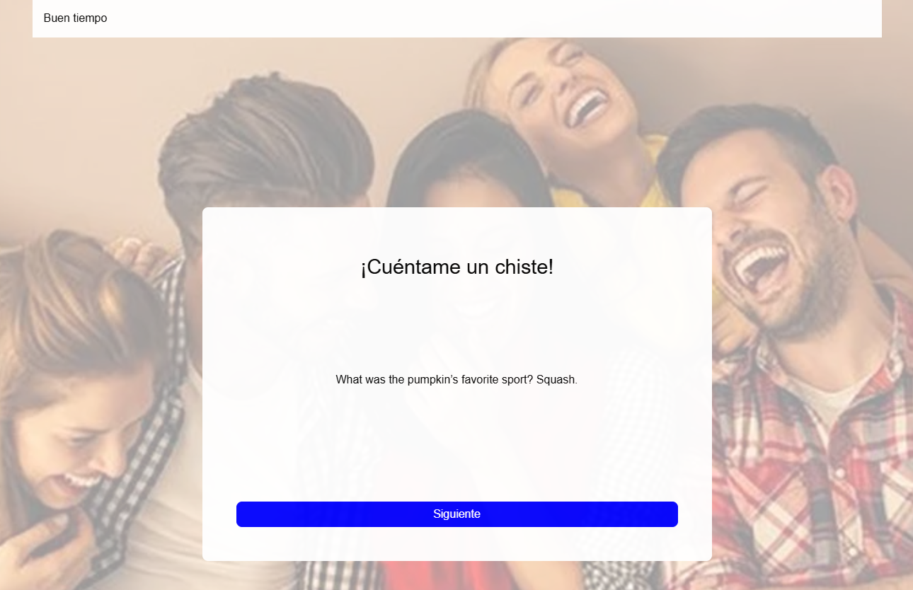
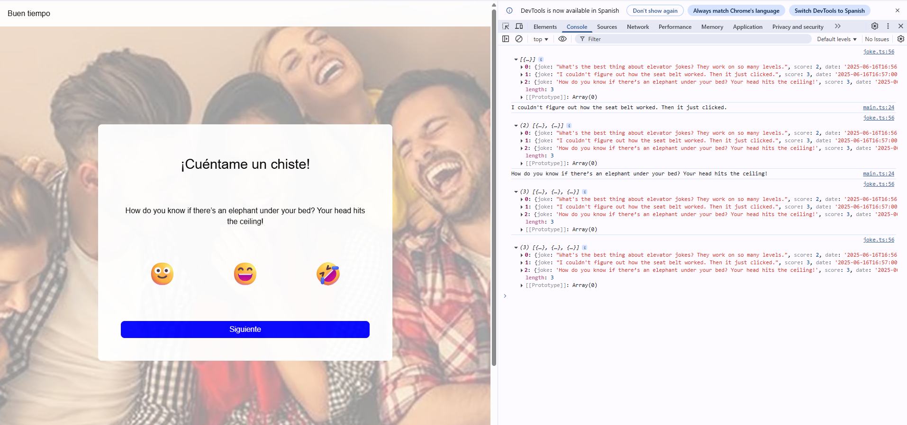
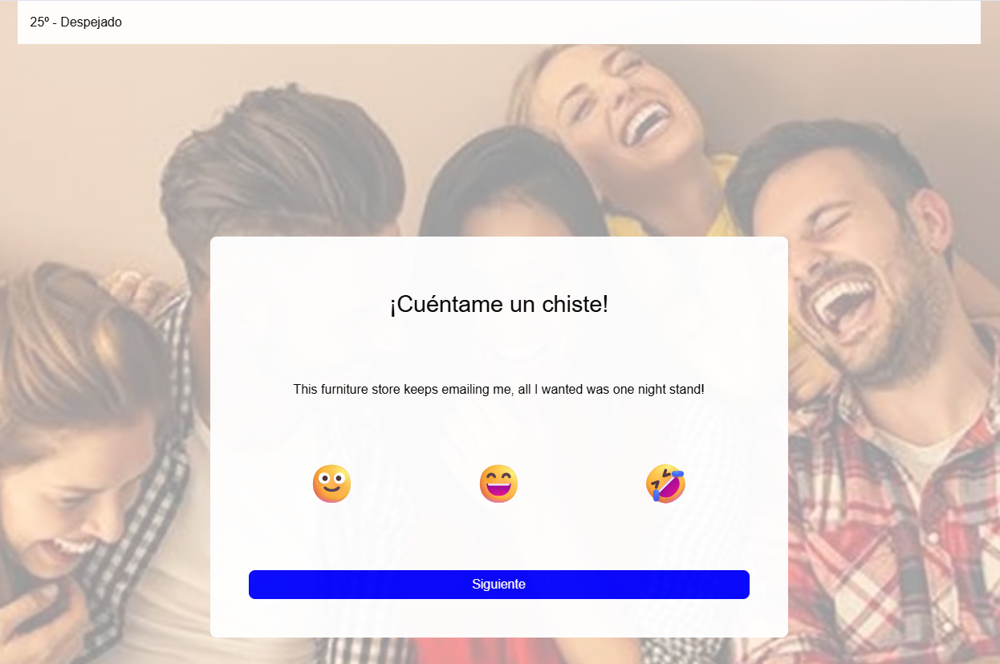
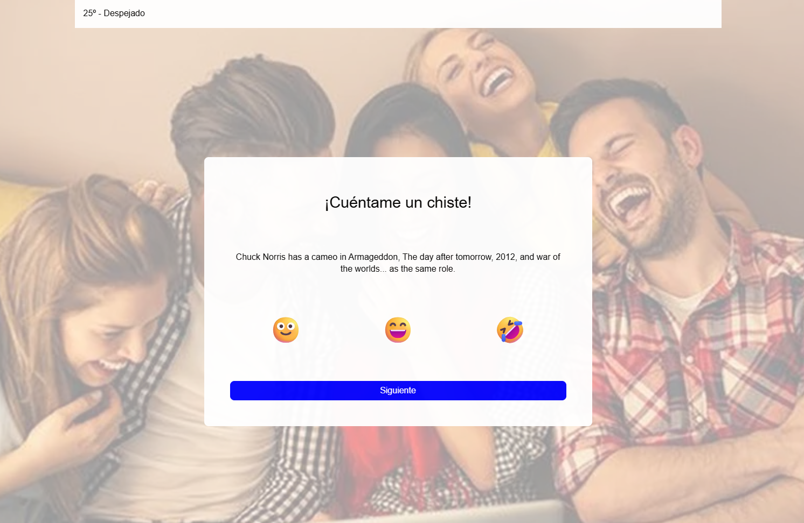
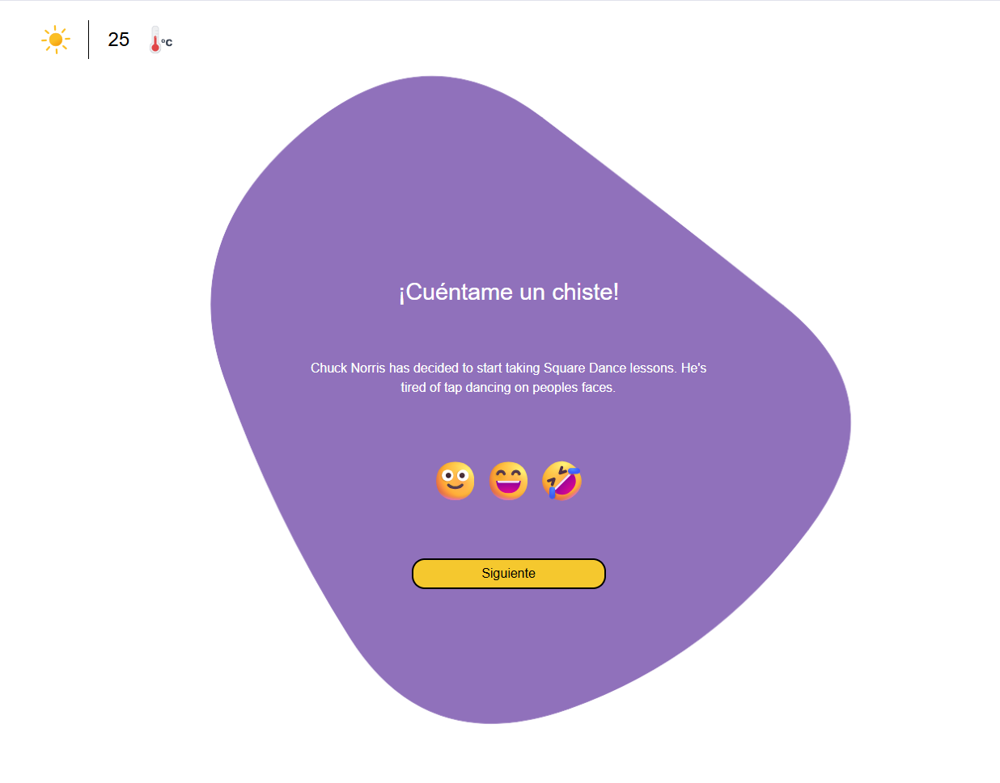
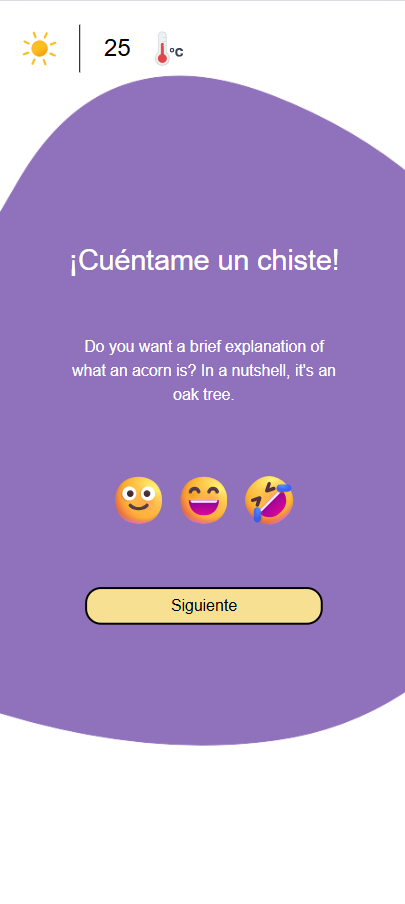

# IT-S4-Typescript-API

## 🗂️Tabla de contenidos

- [IT-S4-Typescript-API](#it-s4-typescript-api)
  - [🗂️Tabla de contenidos](#️tabla-de-contenidos)
  - [📄Descripción](#descripción)
    - [1. Obtener chistes de API](#1-obtener-chistes-de-api)
    - [2. Hacer diseño de web básico](#2-hacer-diseño-de-web-básico)
    - [3. Obtener y guardar valoraciones de los chistes](#3-obtener-y-guardar-valoraciones-de-los-chistes)
    - [4. Mostrar prevision del tiempo](#4-mostrar-prevision-del-tiempo)
    - [5. Añadir otras APIs de chistes](#5-añadir-otras-apis-de-chistes)
    - [6. Diseño web mejorado y responsive](#6-diseño-web-mejorado-y-responsive)
  - [💻Tecnologías Utilizadas](#tecnologías-utilizadas)
  - [📋Requisitos](#requisitos)
  - [🛠️Instalación](#️instalación)
    - [1. Descargar el repositorio](#1-descargar-el-repositorio)
    - [2. Instalación de paquetes Node.js](#2-instalación-de-paquetes-nodejs)
    - [3. En el caso de querer usar Vite](#3-en-el-caso-de-querer-usar-vite)
  - [▶️Ejecución](#️ejecución)

## 📄Descripción

Creación de una web de chistes que tenga las siguientes funcionalidades:

### 1. Obtener chistes de API

- Conectar con la API de chistes y mostrar el primero por pantalla.
- Cada vez que se pulse siguiente, mostrar un chiste nuevo.
  
### 2. Hacer diseño de web básico

- Preparar un diseño básico de la página web.



### 3. Obtener y guardar valoraciones de los chistes

- Crear botones para puntuar el chiste
- Crear array para guardar las puntuaciones de los chistes
- Poder modificar la valoracion de un chiste
- Mostrar por consola el array actualizado.
  


### 4. Mostrar prevision del tiempo

- Conectar con una API que nos dé información meteorológica.
- Mostrar en la cabecera la información obtenida.
  


### 5. Añadir otras APIs de chistes

- Añadir la API de chistes de Chuck Norris.
- Obtener chistes aleatoriamente de las APIs.



### 6. Diseño web mejorado y responsive

- Modificar el diseño web para adaptarlo al modelo presentado.
- Hacer diseño adaptable de la web.
  
&nbsp; &nbsp;&nbsp; &nbsp;

## 💻Tecnologías Utilizadas

- HTML
- CSS
- Vite
- Typescript
- API

## 📋Requisitos

- Navegador web
  
## 🛠️Instalación

### 1. Descargar el repositorio

```shell
git clone https://github.com/soyjuandelgado/IT-S4-Typescript-API destino
```

### 2. Instalación de paquetes Node.js

```shell
npm install
```

### 3. En el caso de querer usar Vite

```shell
npm install -D vite
```

Para mas informacion: [Web Vite](https://vite.dev/guide/)

## ▶️Ejecución

Visitar la web: [Web](https://soyjuandelgado.github.io/IT-S4-Typescript-API/)

Para ejecutar en local mediante Vite:

```shell
npm run dev
```
